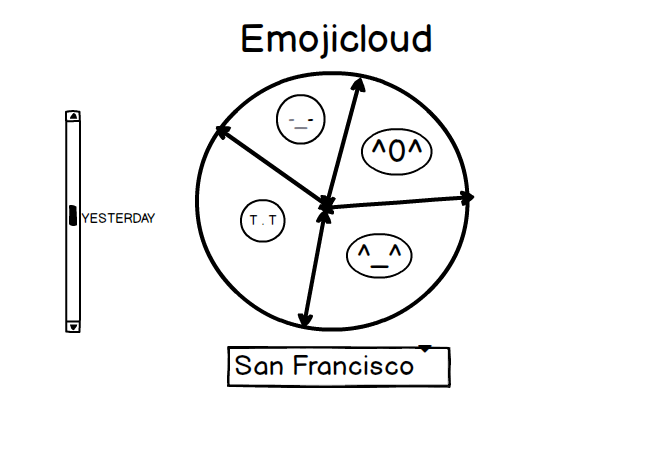

#Emojicloud

##Background

Emojicloud is a visualization of emojis from tweets posted at a certain time or location. Similar to word cloud, more common emojis will be larger in size. Through this visualization, users will be able to get the general sense of how the public is feeling at a certain time and location.

##Functionality & MVP

With Emojicloud, users will be able to:

- [ ] Visualize a cloud of emojis using the Twitter API
- [ ] Rendering of different types of graph of twitter emoji data
- [ ] Have an option to choose different times and locations
- [ ] Click on emojis to see relevant tweets

BONUS
- [ ] Drag around emojis

##Wireframes

##Technologies and Technical Challenges

Emojicloud will be implemented using React as our frontend framework and Ruby on Rails as our backend framework. In addition, we will be using a Javascript library, Data-Driven-Documents(D3), to apply data-driven transformation to the cloud of emojis.

The primary technical challenges will be:

- Implementing D3 in React
- Understanding the limitations of the Twitter API:
    - the number of tweets containing emojis in the API response will need to be large enough to create an emoji cloud
    - parsing the API response data
- Deciding whether to 1) make Twitter API requests directly from the front end or 2) make periodic requests from the backend using Heroku workers and populate our database with a curated and possibly more statistically significantly data set.

##Group Members & Work Breakdown

Our group consists of three members: Mark Noizumi, Peter Delfausse, and Samuel Lee.

Mark's primary responsibilities will be:
- Setting up React to render React objects

Peter's primary responsibilities will be:
- Implementing D3 into emoji objects in React

Samuel's primary responsibilities will be:
- Setting up the backend to receive Twitter API

##Implementation Timeline

**Day 1**: Get started on the infrastructure and test Twitter API. By the end of the day, we will have:

- A completed `package.json` and `entry.jsx` (Mark)
- A completed research on D3 implementation (Peter)
- A completed test of requesting Twitter API and database schema (Sam)

**Day 2**: Continue setting up the infrastructure and test D3 Implementation. By the end of the day, we will have:

- A completed `store.js`, `reducer.js`, and `action.js` (Mark)
- A successful test on manipulating a few twitter emojis with D3 (Peter)
- A completed setup on models and controllers (Sam)

**Day 3**: Finish setting up the infrastructure and test AJAX request from frontend to backened. By the end of the day:

- A completed `component.jsx` and `root.jsx` (Mark)
- A completed D3 implementation on all the components (Peter)
- A completed setup on views and heroku job (Sam)

**Day 4**: Render Twitter emojis on the Browser and some styling. By the end of the day:

- Render Twitter emojis on the screen (Mark)
- An algorithm function that makes the emojis bigger by the number of emojis received (Peter)
- Style the components rendered (Sam)

**Day 5**: Complete styling the website, get a custom domain, and write production README. By the end of the day:
- Get screenshots and write product features of production README (Mark)
- Write technical implementation and code snippets of production README (Peter)
- Finish styling, get a custom domain, write introduction with a LIVE DEMO link of production README (Sam)
